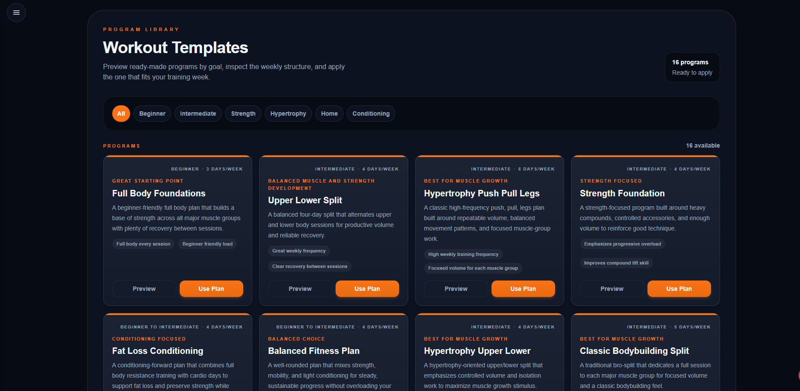
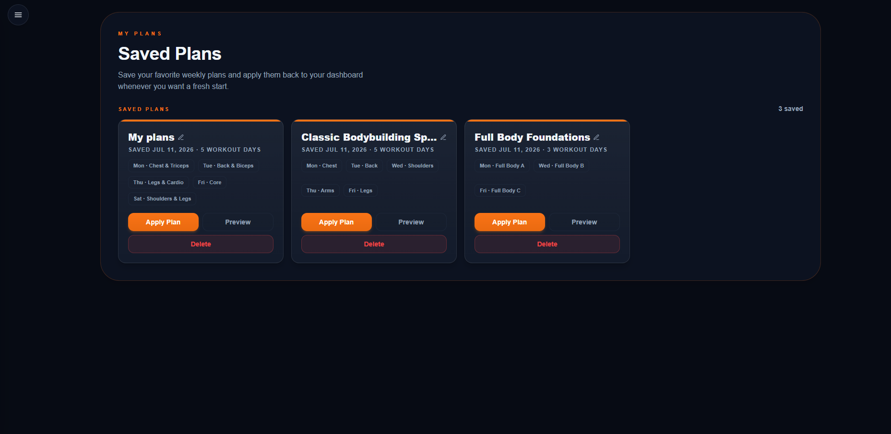

# Flexy

A full-stack fitness planning application — weekly workout planner, searchable exercise library, and reusable workout templates, built with a custom dark-theme design system.

**Live Demo:** _coming soon_ · **Stack:** Next.js 16 · React 19 · TypeScript · Prisma · PostgreSQL

---

### Screenshots


| Workout Templates | Saved Plans |
|---|---|
|  |  |

### Features

- **Weekly Workout Planner** — organize your training week with drag-and-drop reordering, day-by-day status tracking (completed / missed / today) and a live "Today" side panel
- **Workout Templates** — 16 ready-made programs filterable by goal and level, each with preview and one-click apply
- **My Plans** — save weekly plans and re-apply them to your dashboard anytime, with instant name synchronization
- **Exercise Library** — search and filter a full exercise catalog, with a detail page for every exercise
- **Secure Authentication** — JWT sessions in httpOnly cookies, passwords hashed with bcrypt
- **Personalization** — user settings such as week-start preference

### Tech Stack

| Layer | Technology |
|---|---|
| Framework | Next.js 16 (App Router) |
| UI | React 19, Tailwind CSS 4 |
| Language | TypeScript 5 (strict mode) |
| Database | PostgreSQL (Neon) |
| ORM | Prisma |
| Auth | jose (JWT), bcryptjs, httpOnly cookies |
| Drag & Drop | dnd-kit |
| Hosting | Vercel |

### Architecture

- **Server/client separation** — data fetched in React Server Components, interactivity in focused client components
- **Middleware-protected routes** — private routes validate the JWT from an httpOnly cookie before rendering
- **Relational data model** — users, plans, workouts and exercises modeled in Prisma with referential integrity
- **Context-driven state** — a `PlanProvider` keeps templates and plans in sync across the UI
- **Design tokens** — colors, spacing and typography defined once via Tailwind 4 `@theme`

### Run It Locally

Requires Node.js 18+ and a PostgreSQL database ([Neon](https://neon.tech) has a free tier).

```bash
git clone https://github.com/semih-bas/Flexy.git
cd Flexy
npm install

cp .env.example .env   # fill in DATABASE_URL and JWT_SECRET

npx prisma generate
npx prisma db push

npm run dev
```

The app runs at `https://flexy-tau.vercel.app/`.

| Variable | Description |
|---|---|
| `DATABASE_URL` | PostgreSQL connection string |
| `JWT_SECRET` | Secret used to sign JWT session tokens |

### Roadmap

- [x] Core planner, exercise library and templates
- [x] JWT authentication and user settings
- [ ] Production deployment on Vercel
- [ ] Workout history and progress tracking
- [ ] Mobile release (iOS / Android)

### Author

**Semih Baş** — built as a learning-first project: every feature implemented with the goal of understanding *why*, not just *how*.

[GitHub](https://github.com/semih-bas) · [LinkedIn](https://www.linkedin.com/in/bassemih/)
