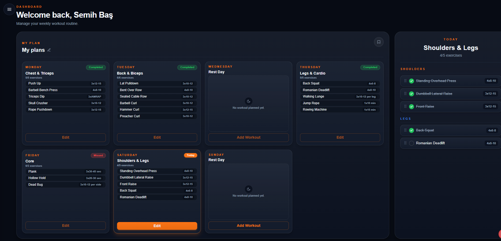

Flexy 🏋️

A full-stack fitness planning application — plan your weekly workouts, browse a searchable exercise library, and build reusable workout templates. Designed with a custom dark-theme design system.

<!-- SCREENSHOT: Add a dashboard screenshot here -->
<!--  -->
🔗 Live Demo: coming soon

✨ Features

Weekly Workout Planner — organize workouts across the week with drag-and-drop reordering (dnd-kit)
Exercise Library — searchable and filterable catalog with dynamic exercise detail pages
Workout Templates — create reusable plans and apply them to your week
My Plans — manage saved plans with real-time name synchronization
Secure Authentication — JWT-based auth with httpOnly cookies (bcryptjs + jose)
Personalization — user settings such as week-start preference
Custom Design System — dark theme built with Tailwind CSS 4 @theme tokens

🛠️ Tech Stack

LayerTechnologyFrameworkNext.js 16 (App Router)UIReact 19, Tailwind CSS 4LanguageTypeScript 5 (strict mode)DatabasePostgreSQL (Neon)ORMPrismaAuthJWT (jose) + bcryptjs, httpOnly cookiesDrag & Dropdnd-kitDeploymentVercel

🏗️ Architecture Highlights

App Router with server/client component separation — data fetching on the server, interactivity on the client
Route protection via middleware validating JWT from httpOnly cookies
Prisma schema modeling users, plans, workouts and exercises with relational integrity
Context-based state (PlanProvider) for template and plan management across the UI

🚀 Getting Started

Prerequisites

Node.js 18+
A PostgreSQL database (e.g. Neon)

Setup

bash# 1. Clone the repository
git clone https://github.com/semih-bas/Flexy.git
cd Flexy

# 2. Install dependencies
npm install

# 3. Configure environment variables
cp .env.example .env
# Fill in DATABASE_URL and JWT_SECRET

# 4. Sync the database schema
npx prisma generate
npx prisma db push

# 5. Run the development server
npm run dev

Open http://localhost:3000 in your browser.

Environment Variables

VariableDescriptionDATABASE_URLPostgreSQL connection string (Neon)JWT_SECRETSecret key for signing JWT tokens

🗺️ Roadmap

 Production deployment on Vercel
 Progress tracking & workout history
 Mobile app release (iOS / Android) with in-app purchases

👤 Author

Semih Baş
GitHub · LinkedInFlexy 🏋️

